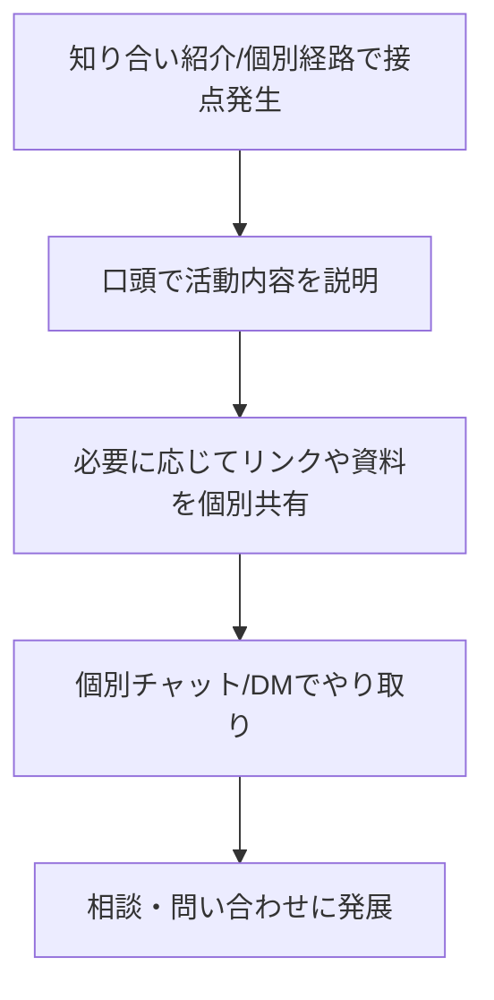
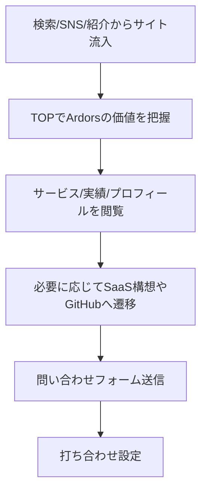

# 業務理解ドキュメント
## プロジェクト名: Ardors

### 1. ビジネス背景
#### 1.1 現状の課題
| # | 課題 | 影響を受ける人 | 頻度 | 深刻度 |
|---|------|-------------|------|--------|
| 1 | 公式サイトが未整備で、Ardors の提供価値（受託・技術コンサル）が初見で伝わりにくい | 代表者（あなた）、見込み顧客 | 商談・紹介時ごと（週1-2回） | 高 |
| 2 | 実績・プロフィール・活動内容の情報が分散し、説明コストが高い | 代表者（あなた） | 問い合わせ前後に毎回 | 高 |
| 3 | 問い合わせ導線が標準化されておらず、機会損失が起きやすい | 見込み顧客、代表者（あなた） | 流入発生時ごと | 高 |
| 4 | SaaS構想と現在のサービス提供の関係が伝わりにくい | 見込み顧客、協業候補 | サイト閲覧時ごと | 中 |

#### 1.2 現在の対処方法
- 知り合い経由の紹介を中心に獲得する。
- 口頭説明や個別メッセージで実績・プロフィールを都度共有する。
- 必要に応じて GitHub / Note / 既存資料URLを個別送付する。

### 2. プロジェクト目的
#### 2.1 ゴール（優先順位付き）
| 優先度 | ゴール | 成功指標（KPI） |
|--------|--------|----------------|
| P0 | 問い合わせ獲得 | 問い合わせフォーム送信が安定して発生する（月1件以上） |
| P0 | 個人ポートフォリオ公開 | 初見訪問者が実績・プロフィールを短時間で把握できる（定性評価） |
| P0 | あなたの活動全体の理解促進 | 「何をしている人か」が1ページ目から理解できる（定性評価） |
| P0 | SaaS構想・実績の公開 | SaaS構想ページや関連リンクへの遷移が発生する（定性評価） |

#### 2.2 リリース計画
- 希望時期: 2026年Q2内の初回公開（段階リリース方式）
- 予算感: 自作のため開発費は最小、運用は `Vercel Hobby` 前提

### 3. スコープ
#### 3.1 対象範囲（In Scope）
- Ardors コーポレートサイト（開発スタジオとしての紹介）
- サービス紹介（受託・技術コンサルティング）
- プロフィール/ポートフォリオ
- 実績掲載（一覧中心）
- 事例紹介CMS（初期はP1、テキスト情報中心）
- SaaS構想の紹介ページまたは紹介セクション（リンク導線中心）
- 問い合わせ導線（フォーム）
- 日本語/英語の2言語対応
- Note RSS 連携セクション
- GitHub への導線

#### 3.2 対象外（Out of Scope）
- ブログCMS（Noteで代替）
- 会員機能（ログイン、マイページ等）
- SaaS本体機能の実装
- 事例紹介CMSでの画像添付機能

#### 3.3 将来拡張構想
- 採用ページ
- SaaS向けの専用LPや待機リスト導線

### 4. 業務フロー
#### 4.1 As-Is（現状）フロー

#### 4.2 To-Be（導入後）フロー

### 5. 外部連携
| 連携先 | 連携方法 | 目的 | 必須/任意 |
|--------|---------|------|----------|
| Note | RSS取得（GitHub Actions 定期更新） | 記事情報の自動表示 | 必須 |
| GA4 | 計測タグ導入 | 流入・回遊・CV把握 | 必須 |
| Google Search Console | サイト登録/検証 | 検索パフォーマンス把握 | 必須 |
| GitHub | 外部リンク | 技術活動・成果物への導線 | 必須 |
| 問い合わせ機能 | サイト内フォーム実装（バックエンドは軽量構成） | 相談獲得 | 必須 |

### 6. 補足提案（品質向上）
- ファーストビューに「誰向けに何を提供するか」を1文で明示する。
- 各ページに明確な CTA（問い合わせ/相談）を配置する。
- 実績は「課題→対応→成果」の3点で短く統一し、読みやすさを優先する。
- OGP・構造化データ・基本SEOを初期から実装する。
- セキュリティ要件を高水準で設計し、フォーム周辺を優先的に防御する。
- 将来の拡張（採用ページ/CMS強化/SaaS導線追加）を見据え、変更容易性をP0要件として扱う。
