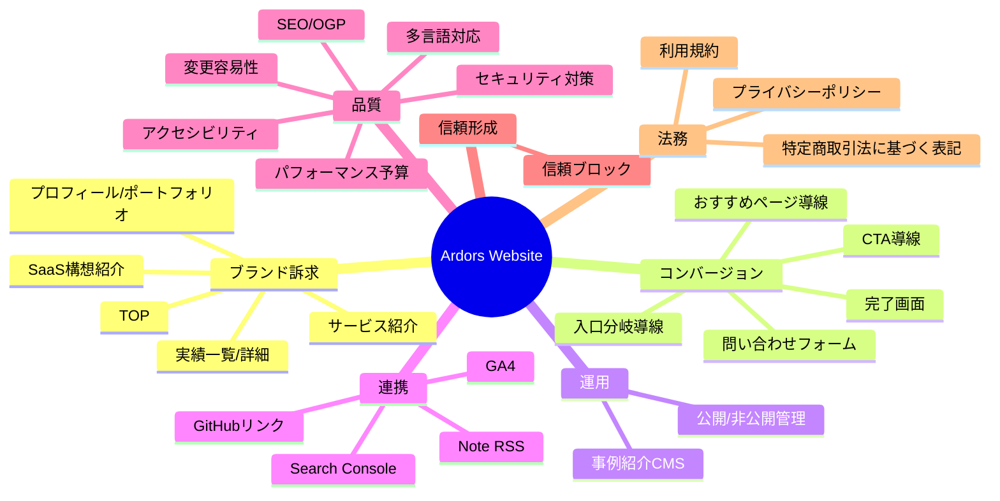

# 機能一覧

### 1. 機能概要マップ

### 2. 機能一覧表

#### 2.1 コアサイト機能
| 機能ID | 機能名 | 説明 | 優先度 | 対象ユーザー |
|--------|--------|------|--------|-------------|
| FR-01 | トップページ | Ardorsの提供価値、主要実績、CTAを提示 | P0 | 全ユーザー |
| FR-02 | サービス紹介 | 受託・技術コンサルの提供内容を提示 | P0 | 全ユーザー |
| FR-03 | プロフィール/ポートフォリオ | 経歴、強み、スキル、成果を提示 | P0 | 全ユーザー |
| FR-04 | 実績一覧 | 実績カードを一覧表示（タグ/カテゴリ含む） | P0 | 全ユーザー |
| FR-05 | 実績詳細 | 実績の課題・対応・成果を詳細表示 | P0 | 全ユーザー |
| FR-06 | SaaS構想紹介 | 自社SaaSの概要と導線を提示 | P0 | 全ユーザー |
| FR-07 | 共通ヘッダー/フッター | グローバルナビ、主要ページ導線、法務リンク、外部リンクを提供 | P0 | 全ユーザー |
| FR-08 | 日本語/英語切替 | JA/EN表示切替を提供 | P0 | 全ユーザー |
| FR-09 | UX強化導線 | 入口分岐、スティッキーCTA、次ページ推薦、心理負担軽減導線を提供 | P0 | 全ユーザー |
| FR-10 | 信頼ブロック | 対応領域・技術・成果サマリ・GitHub導線を集約表示 | P0 | 全ユーザー |

#### 2.2 問い合わせ機能
| 機能ID | 機能名 | 説明 | 優先度 | 対象ユーザー |
|--------|--------|------|--------|-------------|
| FR-20 | 問い合わせフォーム | 相談内容を受け付ける | P0 | 全ユーザー |
| FR-21 | 問い合わせ完了画面 | 送信完了と次アクションを提示 | P0 | 全ユーザー |
| FR-22 | フォーム保護 | バリデーション/スパム対策/レート制限 | P0 | 全ユーザー |

#### 2.3 外部連携・計測
| 機能ID | 機能名 | 説明 | 優先度 | 対象ユーザー |
|--------|--------|------|--------|-------------|
| FR-30 | Note RSS連携 | Note記事の最新情報を表示 | P1 | 全ユーザー |
| FR-31 | GitHub導線 | GitHubへの遷移導線を提供 | P0 | 全ユーザー |
| FR-32 | GA4行動計測 | 行動イベント・CVイベントを実施 | P1 | 運営者 |
| FR-33 | Search Console連携 | 検索パフォーマンス監視 | P1 | 運営者 |

#### 2.4 運用/CMS機能
| 機能ID | 機能名 | 説明 | 優先度 | 対象ユーザー |
|--------|--------|------|--------|-------------|
| FR-40 | 事例紹介CMS（テキスト中心） | 事例の作成/編集/削除を行う | P1 | 運営者 |
| FR-41 | 公開/非公開管理 | 事例の公開状態を切替 | P1 | 運営者 |
| FR-42 | CMS認証 | 管理機能へのアクセス制御 | P1 | 運営者 |

#### 2.5 法務・フッター機能
| 機能ID | 機能名 | 説明 | 優先度 | 対象ユーザー |
|--------|--------|------|--------|-------------|
| FR-60 | プライバシーポリシー | 個人情報取扱いを明示 | P0 | 全ユーザー |
| FR-61 | 利用規約 | サイト利用条件を明示 | P1 | 全ユーザー |
| FR-62 | 特定商取引法に基づく表記 | 法令に沿った表示（該当時） | P1 | 全ユーザー |

#### 2.6 セキュリティ・品質機能
| 機能ID | 機能名 | 説明 | 優先度 | 対象ユーザー |
|--------|--------|------|--------|-------------|
| FR-70 | 入力値検証 | 全入力の型・長さ・形式を厳格検証 | P0 | 全ユーザー |
| FR-71 | セキュアヘッダー | CSP/HSTS/X-Frame-Options等を適用 | P0 | 全ユーザー |
| FR-72 | 監査ログ/監視 | エラー・異常アクセスを検知可能にする | P1 | 運営者 |
| FR-73 | SEO/OGP/構造化データ | 検索最適化と共有最適化 | P0 | 全ユーザー |
| FR-74 | Core Web Vitals 予算管理 | LCP/INP/CLSの目標値を定義し維持する | P0 | 全ユーザー |
| FR-75 | アクセシビリティ基準 | キーボード操作、見出し構造、コントラスト等を満たす | P0 | 全ユーザー |
| FR-76 | 変更容易性設計 | ページ/コンテンツ/導線の変更を低コストで実施できる設計を担保 | P0 | 運営者 |

### 3. 機能詳細（P0）

#### FR-01: トップページ
- **説明**: Ardorsの価値提案、実績ハイライト、問い合わせ導線を提示する。
- **アクター**: U-01, U-02, U-03, U-04
- **入力データ**: コンテンツ定義（見出し、説明、CTAラベル、導線URL）
- **出力/結果**: ページ表示、CTAクリックイベント計測（実装時）
- **ビジネスルール**:
  - BR-01: ファーストビューに「提供対象」「提供価値」「問い合わせ導線」の3要素を必ず含める。
  - BR-02: CTAはファーストビューとページ下部の最低2箇所に表示する。
  - BR-03: モバイル表示でも主要CTAをスクロール無しで1つ表示する。
  - BR-04: ファーストビュー直下に「相談したい」「実績を見たい」「人物を知りたい」の3導線を配置する。
- **エラーケース**:
  - 必須コンテンツ未設定時は公開ビルドを失敗させる。

#### FR-07: 共通ヘッダー/フッター
- **説明**: サイト全体で一貫した主要導線を提供する。
- **アクター**: 全閲覧ユーザー
- **入力データ**: ナビゲーション定義（ページ名、URL、表示順）
- **出力/結果**: 主要ページへの遷移
- **ビジネスルール**:
  - BR-07-01: フッターに法務リンクのみでなく、主要ページ導線（例: サービス、実績、プロフィール、問い合わせ）を配置する。
  - BR-07-02: フッター導線は「初見訪問者が次に見たい情報」を優先順で配置する。
  - BR-07-03: モバイルでもフッター導線を2タップ以内で辿れる情報設計とする。
  - BR-07-04: フッターはタスク優先順（依頼したい→実績を見る→プロフィール→SaaS→問い合わせ→法務）を基本とする。

#### FR-05: 実績詳細
- **説明**: 実績の背景・対応・成果を構造化して表示する。
- **アクター**: 全閲覧ユーザー
- **入力データ**: 事例ID、タイトル、課題、対応、成果、公開状態
- **出力/結果**: 実績詳細ページ表示
- **ビジネスルール**:
  - BR-10: 「課題」「対応」「成果」の3セクションを必須とする。
  - BR-11: 非公開状態の事例は公開URLから参照不可とする。
  - BR-12: 削除済み/未公開事例へのアクセスは404を返す。
  - BR-13: ページ末尾に「次におすすめのページ」を最低2件表示する。

#### FR-04: 実績一覧
- **説明**: 実績を一覧で表示し、目的別に絞り込めるようにする。
- **アクター**: 全閲覧ユーザー
- **入力データ**: 実績メタ情報（カテゴリ、成果軸、公開状態）
- **出力/結果**: 一覧表示、絞り込み結果表示
- **ビジネスルール**:
  - BR-04-01: 成果軸（例: 売上改善、工数削減、速度改善）でフィルタ可能にする。
  - BR-04-02: 絞り込み状態はURLに反映し、共有可能にする。

#### FR-08: 日本語/英語切替
- **説明**: ページ単位でJA/ENの表示を切り替える。
- **アクター**: 全閲覧ユーザー
- **入力データ**: 言語選択値（ja/en）
- **出力/結果**: 選択言語でページ表示
- **ビジネスルール**:
  - BR-20: 言語切替後は同一コンテンツの対応言語ページへ遷移する。
  - BR-21: 対応言語が未用意の要素は公開しない（プレースホルダー表示を禁止）。
  - BR-22: 言語切替時にトップページへ強制遷移させない。

#### FR-09: UX強化導線
- **説明**: 迷わず次の行動に進める回遊導線を全体設計として提供する。
- **ビジネスルール**:
  - BR-09-01: 各ページ末尾に「次におすすめのページ」を2件以上表示する。
  - BR-09-02: 問い合わせ直前に「返信目安」「相談だけでもOK」を明示し心理負担を下げる。
  - BR-09-03: グローバルCTAは常時見える位置に固定する（モバイル/デスクトップ両対応）。

#### FR-10: 信頼ブロック
- **説明**: 訪問者が短時間で信頼判断できる情報を1セクションに集約する。
- **ビジネスルール**:
  - BR-10-01: 「対応領域」「技術」「成果サマリ」「外部実績（GitHub）」の4要素を含める。
  - BR-10-02: 主要ページから1クリックで到達可能にする。

#### FR-20: 問い合わせフォーム
- **説明**: サービス相談を受け付ける。
- **アクター**: 全閲覧ユーザー
- **入力データ**: 名前、メールアドレス、相談種別、本文
- **出力/結果**: 受付完了/入力エラー
- **ビジネスルール**:
  - BR-30: メールアドレスはRFC準拠形式のみ許可する。
  - BR-31: 本文は1〜3000文字のみ許可する。
  - BR-32: 必須項目不足時は送信を受け付けない。
  - BR-33: 送信成功時のみ完了画面へ遷移する。
  - BR-34: フォーム画面に「返信目安」「相談のみ歓迎」の補助文を表示する。

#### FR-22 / FR-70 / FR-71: セキュリティ対策
- **説明**: フォーム・HTTPレスポンス・入力処理を安全化する。
- **アクター**: 全ユーザー
- **入力データ**: 全ユーザー入力、HTTPリクエスト
- **出力/結果**: 不正入力/不正アクセスを遮断
- **ビジネスルール**:
  - BR-40: サーバー側で入力検証を必須化し、クライアント検証のみで完結させない。
  - BR-41: 同一IPのフォーム送信は1分あたり5件以下に制限する。
  - BR-42: CSP/HSTS/X-Frame-Options/X-Content-Type-Options を適用する。
  - BR-43: 例外メッセージに内部情報（スタックトレース、秘密値）を含めない。

#### FR-32: GA4行動計測
- **説明**: UX改善の意思決定に必要な行動イベントを計測する。
- **ビジネスルール**:
  - BR-32-01: `CTAクリック` `実績詳細閲覧` `フォーム到達` `フォーム送信` をイベント計測する。
  - BR-32-02: 主要イベントはページ/言語/流入元の軸で分析可能にする。

#### FR-74: Core Web Vitals 予算管理
- **説明**: UX品質を性能指標で継続管理する。
- **ビジネスルール**:
  - BR-74-01: LCP <= 2.5s（75パーセンタイル）
  - BR-74-02: INP <= 200ms（75パーセンタイル）
  - BR-74-03: CLS <= 0.1（75パーセンタイル）

#### FR-75: アクセシビリティ基準
- **説明**: 誰でも利用しやすいUI品質を担保する。
- **ビジネスルール**:
  - BR-75-01: 全主要操作をキーボードで実行可能にする。
  - BR-75-02: 見出し構造を階層順（h1-h2-h3）で保持する。
  - BR-75-03: 文字色/背景色のコントラスト比を基準内にする。
  - BR-75-04: 画像やアイコンに適切な代替テキストを設定する。

#### FR-76: 変更容易性設計
- **説明**: 要件変更やページ追加時の影響範囲を局所化する。
- **アクター**: U-05（運営者）
- **入力データ**: ナビゲーション定義、ページ構成定義、コンテンツスキーマ
- **出力/結果**: 既存ページを壊さずに変更を反映できる
- **ビジネスルール**:
  - BR-76-01: ヘッダー/フッター/CTA/信頼ブロック等の共通UIは再利用コンポーネントとして分離する。
  - BR-76-02: 画面遷移に関わるURL・ラベル・表示順は単一の定義ソースで管理する。
  - BR-76-03: 事例データと表示ロジックを分離し、コンテンツ更新だけで公開情報を更新可能にする。
  - BR-76-04: 新規公開画面追加時の必須変更箇所を3箇所以内（ルーティング定義、ナビ定義、画面実装）に制約する。
  - BR-76-05: P1機能（CMS/法務拡張）の有効化時にP0公開導線を壊さない互換性を維持する。

#### FR-60: プライバシーポリシー
- **説明**: 個人情報の取扱いを明示するページを提供する。
- **ビジネスルール**:
  - BR-50: フッターから1クリックで遷移可能にする。
  - BR-51: 問い合わせフォーム画面から明示的に参照可能にする。

### 4. 優先度サマリー
| 優先度 | 機能数 | 主要機能 |
|--------|--------|---------|
| P0 | 21件 | コアページ、問い合わせ、多言語、UX強化、基本セキュリティ、法務最小構成、変更容易性 |
| P1 | 9件 | Note/計測連携、事例CMS、管理認証、法務拡張、監視 |
| P2 | 0件 | - |
| P3 | 0件 | - |

### 5. UX改善アイデア（実装候補）
- IA（情報設計）: 「誰向けか」「何を提供するか」「次に何をすべきか」を全ページで統一。
- 回遊設計: 実績詳細の末尾に関連実績・問い合わせCTAを配置。
- 信頼形成: 実績は定量成果（期間、改善率、工数削減等）を可能な範囲で明示。
- フッター設計: 法務ページに加えて「主要ページ導線」「来訪者が次に見たいページ導線」を第2ナビとして配置する。
- 導線最適化: 各ページの末尾に「次におすすめのページ」セクションを設ける。
- 本ドキュメントでは上記UX改善アイデアを全て機能要件へ昇格済み。
