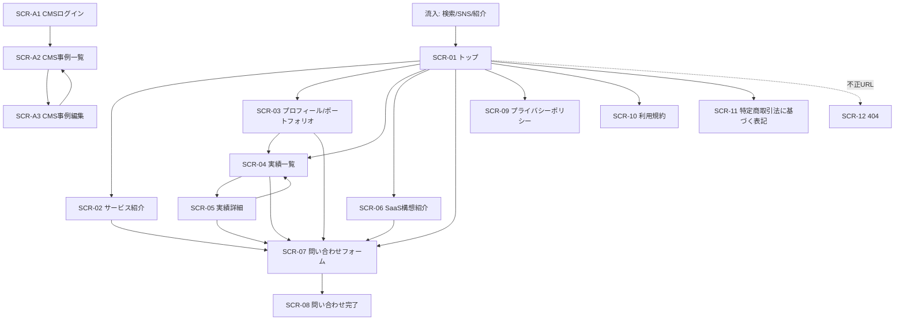
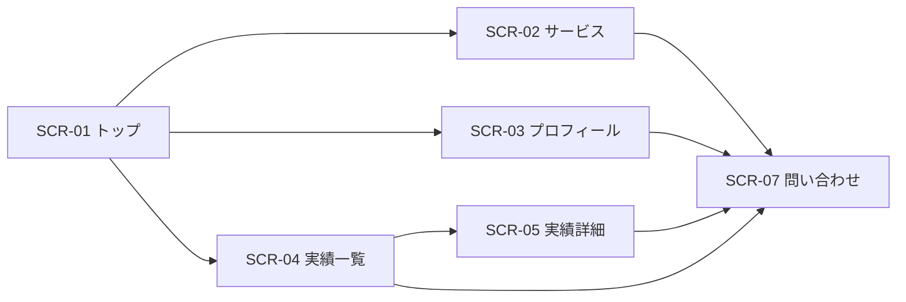
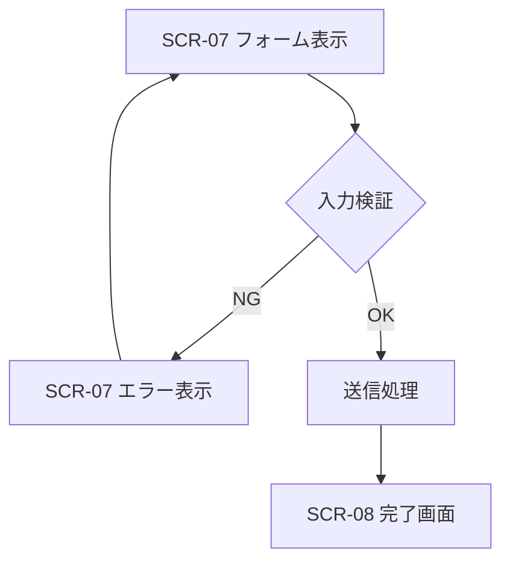
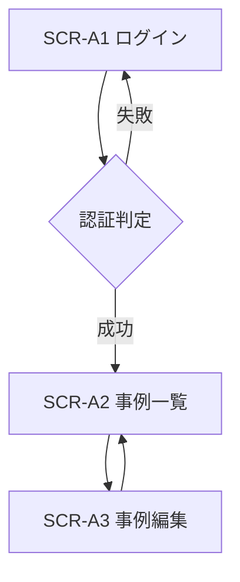

# 画面遷移図

### 1. 画面一覧
| 画面ID | 画面名 | URL（案） | 概要 | 対象ユーザー | 認証要否 |
|--------|--------|-----------|------|-------------|---------|
| SCR-01 | トップ | `/` | Ardorsの価値提案、主要導線、CTAを提示 | 全ユーザー | 不要 |
| SCR-02 | サービス紹介 | `/services` | 受託/技術コンサルの内容・進め方を提示 | 全ユーザー | 不要 |
| SCR-03 | プロフィール/ポートフォリオ | `/profile` | 経歴、強み、スキル、実績ハイライトを提示 | 全ユーザー | 不要 |
| SCR-04 | 実績一覧 | `/works` | 実績を一覧表示し、成果軸で絞り込み可能 | 全ユーザー | 不要 |
| SCR-05 | 実績詳細 | `/works/{slug}` | 実績の課題・対応・成果を詳細提示 | 全ユーザー | 不要 |
| SCR-06 | SaaS構想紹介 | `/saas` | SaaS構想の概要と導線を提示 | 全ユーザー | 不要 |
| SCR-07 | 問い合わせフォーム | `/contact` | 相談内容の入力・送信 | 全ユーザー | 不要 |
| SCR-08 | 問い合わせ完了 | `/contact/complete` | 送信完了通知と次アクション導線 | 全ユーザー | 不要 |
| SCR-09 | プライバシーポリシー | `/privacy` | 個人情報取扱いの明示 | 全ユーザー | 不要 |
| SCR-10 | 利用規約 | `/terms` | サイト利用条件の明示 | 全ユーザー | 不要 |
| SCR-11 | 特定商取引法に基づく表記 | `/legal/tokushoho` | 法令準拠情報の明示（該当時） | 全ユーザー | 不要 |
| SCR-12 | 404 | `/404` | 存在しないページへの到達時表示 | 全ユーザー | 不要 |
| SCR-A1 | CMSログイン | `/admin/login` | 管理画面ログイン（P1） | U-05 | 必要 |
| SCR-A2 | CMS事例一覧 | `/admin/cases` | 事例の一覧/公開状態の確認（P1） | U-05 | 必要 |
| SCR-A3 | CMS事例編集 | `/admin/cases/{id}` | 事例の作成/編集/削除（P1） | U-05 | 必要 |

### 2. 画面遷移図（全体）

### 3. 画面遷移図（機能別）
#### 3.1 公開サイト回遊フロー

#### 3.2 問い合わせフロー

#### 3.3 CMS管理フロー（P1）

### 4. 各画面の概要
#### SCR-01: トップ
- **主要要素**: 価値提案、入口分岐導線、信頼ブロック、主要CTA
- **遷移先**: SCR-02, SCR-03, SCR-04, SCR-06, SCR-07, SCR-09, SCR-10, SCR-11
- **関連機能**: FR-01, FR-07, FR-09, FR-10

#### SCR-02: サービス紹介
- **主要要素**: 提供メニュー、進行フロー、相談導線
- **遷移先**: SCR-07
- **関連機能**: FR-02, FR-07, FR-09

#### SCR-03: プロフィール/ポートフォリオ
- **主要要素**: プロフィール、スキル、実績サマリ、GitHub導線
- **遷移先**: SCR-04, SCR-07
- **関連機能**: FR-03, FR-10, FR-31

#### SCR-04: 実績一覧
- **主要要素**: 実績カード一覧、成果軸フィルタ、問い合わせCTA
- **遷移先**: SCR-05, SCR-07
- **関連機能**: FR-04, FR-09

#### SCR-05: 実績詳細
- **主要要素**: 課題/対応/成果、関連導線、次ページ推薦
- **遷移先**: SCR-04, SCR-07
- **関連機能**: FR-05, FR-09

#### SCR-06: SaaS構想紹介
- **主要要素**: 構想概要、現状ステータス、外部導線
- **遷移先**: SCR-07
- **関連機能**: FR-06

#### SCR-07: 問い合わせフォーム
- **主要要素**: 入力フォーム、返信目安、プライバシー導線
- **遷移先**: SCR-08（送信成功時）
- **関連機能**: FR-20, FR-22, FR-60, FR-70

#### SCR-08: 問い合わせ完了
- **主要要素**: 送信完了メッセージ、次行動導線
- **遷移先**: SCR-01, SCR-04, SCR-06
- **関連機能**: FR-21

#### SCR-09: プライバシーポリシー
- **主要要素**: 個人情報の利用目的、管理方針、問い合わせ窓口
- **遷移先**: SCR-07
- **関連機能**: FR-60

#### SCR-10: 利用規約
- **主要要素**: 利用条件、免責、禁止事項
- **遷移先**: SCR-01
- **関連機能**: FR-61

#### SCR-11: 特定商取引法に基づく表記
- **主要要素**: 事業者情報、価格、支払/提供条件
- **遷移先**: SCR-01
- **関連機能**: FR-62

#### SCR-12: 404
- **主要要素**: エラーメッセージ、トップ戻り導線、主要導線
- **遷移先**: SCR-01, SCR-07
- **関連機能**: FR-07, FR-09

#### SCR-A1: CMSログイン（P1）
- **主要要素**: ID/パスワード入力、認証失敗時メッセージ
- **遷移先**: SCR-A2
- **関連機能**: FR-42

#### SCR-A2: CMS事例一覧（P1）
- **主要要素**: 事例一覧、公開状態、編集導線、新規作成導線
- **遷移先**: SCR-A3
- **関連機能**: FR-40, FR-41

#### SCR-A3: CMS事例編集（P1）
- **主要要素**: 事例入力フォーム、保存/公開/下書き操作、削除操作
- **遷移先**: SCR-A2
- **関連機能**: FR-40, FR-41

### 5. 変更に強い設計方針（画面設計）
- SCR-ID（`SCR-*`）は公開URL変更時も原則維持し、仕様追跡を可能にする。
- 公開ナビゲーションは単一設定ソースで管理し、画面追加時の差分を局所化する。
- P1管理画面は `/admin/*` 配下に隔離し、P0公開サイトとの依存を最小化する。
- URL変更時は旧URLから301リダイレクトを設定し、導線切れとSEO低下を防ぐ。
- 新規画面追加時は「画面一覧」「全体遷移図」「関連機能ID」の3点更新を必須チェック項目とする。
